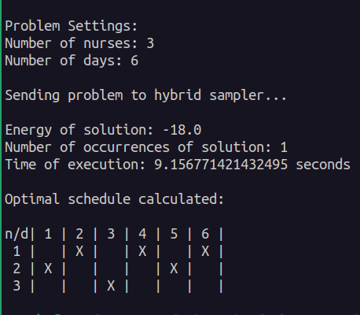

# Quantum Optimization for Nurse Scheduling Problem (NSP)

This project explores the application of Quantum Optimization for solving scheduling problems. The code is designed to run on a D-Wave's QPU. Check out the project [report](https://github.com/ThomasLagkalis/TUC-ARCHIVE/blob/main/Quantum_Qomputin_MATH303/report.pdf)

## Dependencies

To run this project, you'll need the following dependencies:

- Python (>=3.6)
- dimod API
- dwave-system

## Usage 

After you have installed all dependencies you can either download the .zip file manualy from GitHub or clone the repo with this command:

```console 
git clone https://github.com/ThomasLagkalis/TUC-ARCHIVE.git ;cd TUC-ARCHIVE/Quantum_Qomputin_MATH303
```

This command will download the whole repo, if you wish you can delete the other projects.

Now run the nurse_scheduling_problem.py. You must specify two parameters: the first parameter is the number of nurses and the second is the number of days for the schedule i.g. 2 nurses and 3 days. (note in your case it might be *python* instead of *python3*). 

```console 
python3 nurse_scheduling_porblem.py 2 3
```

The default solver used is the classical one which uses brute force algorithm to minimize the objective functio. 
If you want to use the hybrid (quantum-classical) solver you can specify it with the option: --hybrid

```console 
python3 nurse_scheduling_porblem.py 2 3 --hybrid
```

## Results 

After you run the programm the results should look something like this:




